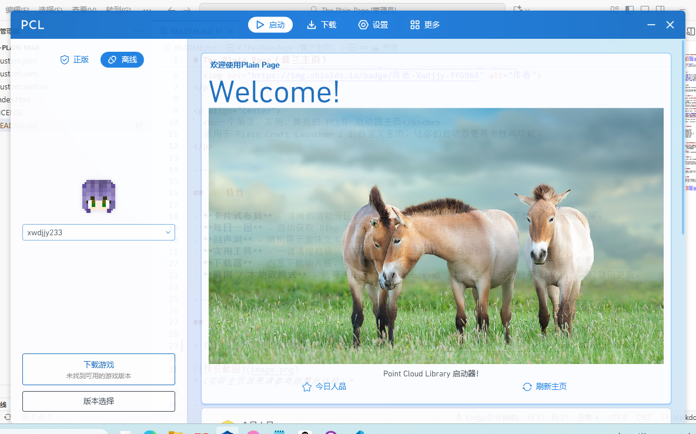
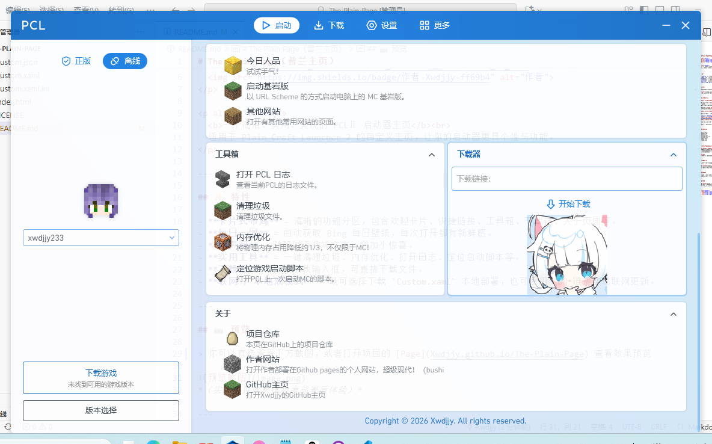

# The Plain Page（普兰主页）

  
  
  

  <b>一个简洁的 PCLⅡ 启动器主页</b> 
  适用于 Plain Craft Launcher 2 的自定义主页

## 预览

> 你可以直接看看下方截图查看效果预览

*（实际主页效果请参考部署后体验）*

## 部署与食用

### 方法一：本地部署

1. 点击仓库中的 [`Custom.xaml`](Custom.xaml) 文件，然后点击“下载”按钮
2. 将下载的 `Custom.xaml` 文件放入 PCLⅡ 同级目录下的 `\PCL` 文件夹内。
3. 在 PCLⅡ 的“设置”→“个性化”→“主页”中选择“读取本地文件”即可生效。

### 方法二：联网部署

如果你希望每次打开主页都自动获取最新版本（无需手动更新），可以使用以下链接：

- **jsDelivr CDN（推荐）**  
  `https://cdn.jsdelivr.net/gh/Xwdjjy/The-Plain-Page/Custom.xaml`
- **GitHub Pages**  
  `https://xwdjjy.github.io/The-Plain-Page/Custom.xaml`
- **Github Release**  
  `https://github.com/Xwdjjy/The-Plain-Page/releases/latest/download/Custom.xaml`

在 PCLⅡ 的“主页”设置中选择“联网更新”，粘贴上述链接即可。

> 注意：第一次联网模式加载需要 PCLⅡ 保持网络连接。

## 🙏 致谢

- 感谢 Bing 每日壁纸 API
- 以及所有使用和关注本项目的朋友！

---
欢迎任何形式的贡献！你可以：

- 提交 [Issue](https://github.com/Xwdjjy/The-Plain-Page/issues) 报告 Bug 或提出新功能建议
- Fork 本仓库，修改后提交 Pull Request
- 点个 ⭐Star 支持作者！

Copyright © 2026 Xwdjjy. All rights reserved.  
本项目仅供个人学习与使用，未经许可不得用于商业用途。

  <a href="https://github.com/Xwdjjy">作者 GitHub</a> · 
  <a href="https://xwdjjy.github.io/src/projects/plain_page/redirect/">作者网站</a> · 
  <a href="https://github.com/Xwdjjy/The-Plain-Page">项目仓库</a>

